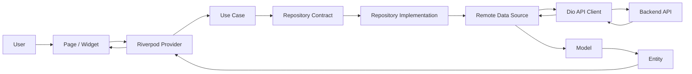
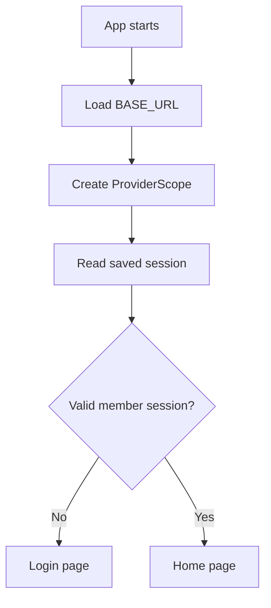
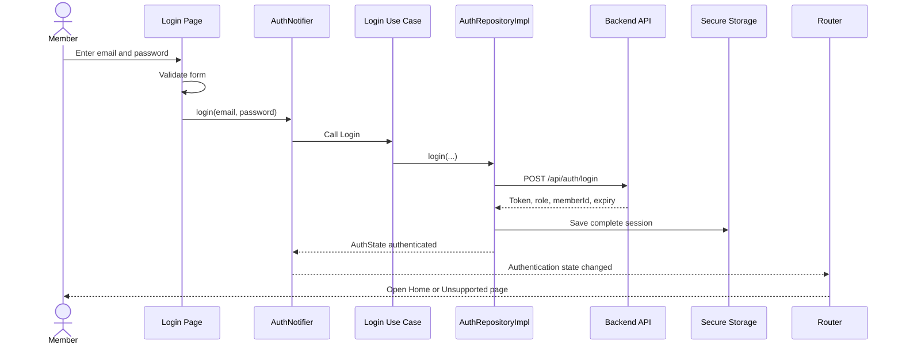
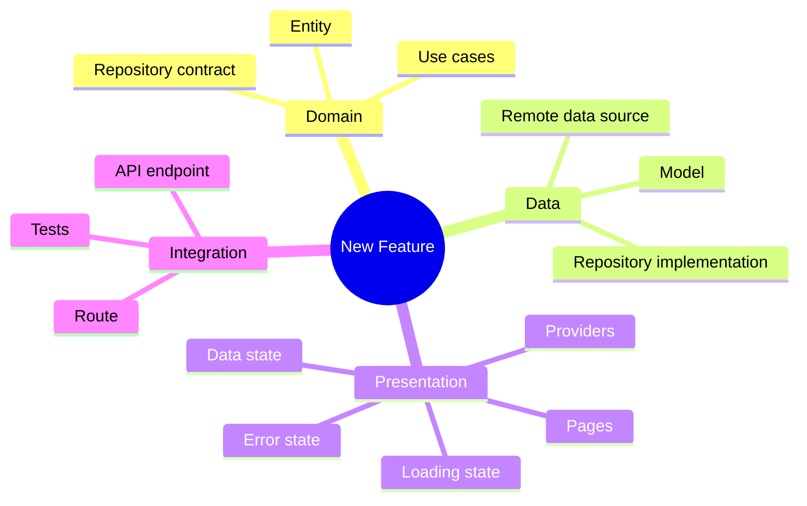
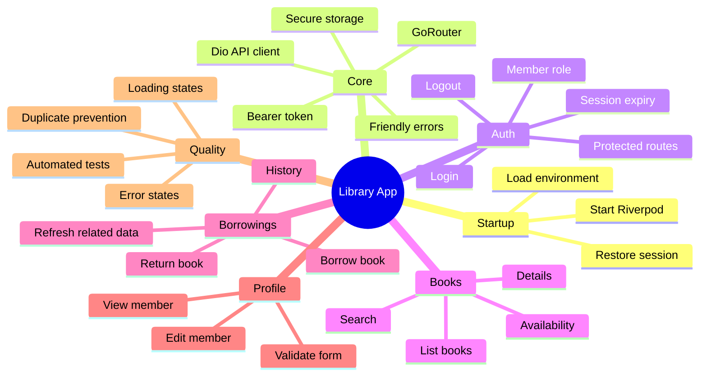

# Library Mobile App — Complete Implementation Guide

This note explains the current Flutter application from start to finish in simple language. It describes the code currently merged into the `feature/auth` branch, including authentication, books, borrowings, returns, profiles, routing, API access, secure storage, Riverpod, and tests.

---

## 1. What this application does

This is a mobile application for a library member.

A member can:

- Log in with an email and password.
- Stay logged in while the saved session is valid.
- Browse all books.
- Search books by title or author.
- Open one book and see its details.
- Borrow a book.
- See their borrowing history.
- Return a borrowed or overdue book.
- View their member profile.
- Update their name, profile email, and phone number.
- Log out.

The mobile application is intended for members. If an unsupported role such as an administrator logs in, the app shows the **Access Unsupported** page.

---

## 2. Main technologies

| Technology | Simple purpose |
|---|---|
| Flutter | Builds the screens and mobile application |
| Dart | Programming language used by Flutter |
| Riverpod | Creates dependencies and manages loading, data, and error state |
| GoRouter | Changes pages and protects routes |
| Dio | Sends HTTP requests to the backend |
| flutter_dotenv | Reads the backend base URL from `.env` |
| flutter_secure_storage | Safely stores the token and session information |
| flutter_test | Tests models, API communication, providers, and widgets |

---

## 3. The most important idea: Clean Architecture

The app is organized by **feature**. Most features have three layers:

```text
Presentation → Domain → Data → Backend
```

The result returns in the opposite direction:

```text
Backend → Data → Domain → Presentation
```

### What each layer means

| Layer | Contains | Easy meaning |
|---|---|---|
| Presentation | Pages and Riverpod providers | What the user sees and the current UI state |
| Domain | Entities, repository contracts, and use cases | The app's rules and actions |
| Data | Models, remote data sources, and repository implementations | JSON conversion and real backend communication |

### Complete architecture flow



### Easy sentence to remember

> **Page asks Provider, Provider calls Use Case, Use Case calls Repository, Repository calls Data Source, and Data Source calls the API.**

---

## 4. Project structure

```text
lib/
├── main.dart
├── app.dart
├── core/
│   ├── api/
│   │   ├── api_client.dart
│   │   ├── api_exception.dart
│   │   └── api_providers.dart
│   ├── router/
│   │   ├── app_router.dart
│   │   └── main_shell.dart
│   └── storage/
│       └── secure_storage_service.dart
└── features/
    ├── auth/
    │   ├── data/
    │   ├── domain/
    │   └── presentation/
    ├── books/
    │   ├── data/
    │   ├── domain/
    │   └── presentation/
    ├── borrowings/
    │   ├── data/
    │   ├── domain/
    │   └── presentation/
    ├── home/
    │   └── presentation/
    └── profile/
        ├── data/
        ├── domain/
        └── presentation/
```

`core` contains shared code used by many features. `features` contains code for individual parts of the application.

---

## 5. What happens when the app starts

### Step 1: `main.dart`

`main()` is the first function that runs.

It performs three jobs:

1. Loads `.env` so the app knows the backend `BASE_URL`.
2. Wraps the app in `ProviderScope` so Riverpod works everywhere.
3. Starts `LibraryApp`.

```dart
Future<void> main() async {
  await dotenv.load(fileName: '.env');

  runApp(
    const ProviderScope(
      child: LibraryApp(),
    ),
  );
}
```

### Step 2: `app.dart`

`LibraryApp` watches `routerProvider` and gives the router to `MaterialApp.router`.

```dart
final router = ref.watch(routerProvider);

return MaterialApp.router(
  routerConfig: router,
);
```

### Step 3: restore the saved session

When `authProvider` is created, `AuthNotifier.build()` calls `restoreSession()`.

The repository reads four saved values:

- Access token
- Member ID
- Role
- Expiration date

The restored session is accepted only when:

- The token exists and is not empty.
- The member ID exists.
- The saved role is `Member`.
- The expiration time exists.
- The expiration time is still in the future.

If one check fails, the saved session is cleared and the user becomes logged out.

### Step 4: router chooses the correct page

The router watches the authentication state:

- Logged out → `/login`
- Logged in as a member → `/home`
- Logged in with an unsupported role → `/unsupported`



---

## 6. Shared core implementation

## 6.1 API client

File: `lib/core/api/api_client.dart`

`ApiClient` creates one configured Dio client.

It sets:

- The base URL from `.env`.
- JSON as the content type.
- Ten-second connection, sending, and receiving timeouts.

Before every request, its interceptor reads the access token from secure storage. When a token exists, it adds this header:

```http
Authorization: Bearer <token>
```

Because this happens centrally, books, borrowings, and profiles do not need to add the token themselves.

## 6.2 API providers

File: `lib/core/api/api_providers.dart`

Riverpod creates the shared objects:

```text
secureStorageServiceProvider
             ↓
      apiClientProvider
```

Any feature can watch `apiClientProvider` and receive the configured API client.

## 6.3 API exceptions

File: `lib/core/api/api_exception.dart`

Raw Dio errors are changed into simple `ApiException` objects.

| HTTP status | App exception type | Meaning |
|---|---|---|
| 400 | `badRequest` | Sent information is invalid |
| 401 | `unauthorized` | Login/session is missing or invalid |
| 403 | `forbidden` | User is known but cannot do this action |
| 404 | `notFound` | Requested record does not exist |
| 409 | `conflict` | Request conflicts with the current backend state |
| Other/network failure | `network` | Request could not be completed normally |

Each data source provides messages appropriate to its feature. This lets the UI show understandable messages instead of Dio error text.

## 6.4 Secure storage

File: `lib/core/storage/secure_storage_service.dart`

The following session values are stored securely:

```text
access_token
member_id
role
expires_at
```

`saveSession()` saves all four values. `clearSession()` removes all four values. `Future.wait()` performs the independent storage operations together.

The member ID is important because borrowing history, borrowing a book, and the profile all belong to the currently logged-in member.

---

## 7. Routing and navigation

## 7.1 Routes

File: `lib/core/router/app_router.dart`

| Path | Page |
|---|---|
| `/login` | Login page |
| `/unsupported` | Unsupported role page |
| `/home` | Home page |
| `/books` | Books list |
| `/books/:id` | Details for one book |
| `/my-borrowings` | Logged-in member's borrowing history |
| `/profile` | Member profile |
| `/profile/edit` | Edit profile form |

`/books/:id` contains a path parameter. For example, `/books/12` opens book ID `12`.

## 7.2 Route protection

The `redirect` function is the route guard.

Its rules are:

1. A logged-out user can only stay on the login page.
2. A logged-in non-member is sent to the unsupported page.
3. A logged-in member cannot return to login or unsupported pages.

The router watches `authProvider`. Therefore, changing the authentication state automatically causes redirect rules to run again.

## 7.3 Main shell

File: `lib/core/router/main_shell.dart`

`ShellRoute` places these pages inside a shared bottom navigation layout:

- Home
- Books
- Borrowings
- Profile

The shell checks the current URL to select the correct navigation item. Tapping an item uses `context.go()` to change the main location.

Book details are outside the shell, so they open as a separate details page. The books list uses `context.push()` so the user can return to the previous page.

---

## 8. Authentication feature

Authentication decides who the user is and whether protected pages can be opened.

## 8.1 Domain layer

### `AuthState`

The authentication entity contains:

- `status`: logged out or authenticated
- `role`: member or admin
- `memberId`: backend member identifier
- `expiresAt`: session expiration time

`isLoggedIn` is a small helper that checks whether the status is authenticated.

### Repository contract

`AuthRepository` defines three actions:

```dart
login(...)
restoreSession()
logout()
```

### Use cases

- `Login` calls `repository.login()`.
- `Logout` calls `repository.logout()`.

These classes are intentionally small. They give each business action a clear name and keep pages independent from repository details.

## 8.2 Data layer

### Auth model

`AuthModel` represents the backend login response:

```text
accessToken + role + memberId + expiresAt
```

`fromJson()` changes JSON into an `AuthModel`. `toEntity()` changes it into `AuthState`.

The role string is handled without case sensitivity. `member` becomes `UserRole.member`; another role becomes `UserRole.admin` in the current implementation.

### Auth remote data source

The login request is:

```http
POST /api/auth/login
Content-Type: application/json

{
  "email": "member@example.com",
  "password": "password"
}
```

The successful response is parsed into `AuthModel`. Dio failures are mapped to friendly messages, such as `Invalid email or password` for a 401 response.

### Auth repository implementation

On login, the repository:

1. Calls the remote data source.
2. Receives the auth model.
3. Saves the complete session securely.
4. Returns an `AuthState` entity.

On app restart, it validates the saved session. On logout, it clears the session.

`FakeAuthRepository` also exists as an earlier/testing-style implementation with hardcoded credentials, but the providers now use the real `AuthRepositoryImpl`.

## 8.3 Presentation layer

### Auth provider dependency chain

```text
ApiClient + SecureStorageService
              ↓
      AuthRemoteDataSource
              ↓
        AuthRepository
              ↓
       Login / Logout
              ↓
         AuthNotifier
```

`AuthNotifier` is an `AsyncNotifier<AuthState>` because session restoration and login are asynchronous.

- `build()` restores the session.
- `login()` changes state to loading and safely runs the login use case.
- `logout()` clears storage and changes state to logged out.

`AsyncValue.guard()` automatically produces either `AsyncData` or `AsyncError`.

### Login page

The login page:

- Uses a `Form` and `GlobalKey<FormState>`.
- Requires an email value.
- Requires a password value.
- Lets the user show or hide the password.
- Disables the login button while loading.
- Shows a progress indicator while logging in.
- Uses `ref.listen()` to show login errors in a snackbar.

The page does not manually navigate after success. The router sees the new authenticated state and redirects the user to `/home`.

### Unsupported role page

This page explains that the mobile app supports members only. Its button logs the user out, after which the router returns to the login page.

### Complete login flow



### Important current behavior

An unsupported role can be shown immediately after login. However, `restoreSession()` only restores a valid **member** session. Therefore, if an unsupported-role user restarts the app, that saved session is cleared and the login page is shown.

---

## 9. Home feature

File: `lib/features/home/presentation/pages/home_page.dart`

The home page is a simple dashboard with three actions:

- Browse Books → `/books`
- My Borrowings → `/my-borrowings`
- My Profile → `/profile`

It has no data or domain layer because it currently only provides navigation.

---

## 10. Books feature

## 10.1 Domain layer

`Book` contains:

- ID
- Title
- Author
- ISBN
- Published year
- Total copies
- Available copies

The calculated property `isAvailable` is true when `availableCopies > 0`.

The repository contract defines:

```dart
getBooks()
getBookById(id)
```

The corresponding use cases are `GetBooks` and `GetBookById`.

## 10.2 Data layer

`BookModel.fromJson()` parses a backend book response. `toEntity()` creates the domain `Book`.

The remote data source sends:

```http
GET /api/books
GET /api/books/{id}
```

The first request returns a list of books. The second returns one book.

`BookRepositoryImpl` calls the remote data source and converts models to entities.

## 10.3 Providers

```text
bookRemoteDataSourceProvider
             ↓
bookRepositoryProvider
             ↓
getBooksProvider / getBookByIdProvider
             ↓
booksProvider / bookDetailsProvider(bookId)
```

`booksProvider` is a `FutureProvider<List<Book>>`.

`bookDetailsProvider` is a `FutureProvider.family<Book, int>`. “Family” means Riverpod keeps separate data for each book ID.

## 10.4 Books page

The page watches `booksProvider` and handles:

- Loading → progress indicator
- Error → friendly error text
- Data → searchable list of books

Search happens locally. It converts the query, title, and author to lowercase and checks whether the title or author contains the query.

Tapping a book pushes `/books/{bookId}`.

## 10.5 Book details page

The details page receives only `bookId`. It asks `bookDetailsProvider(bookId)` for current backend data.

It displays all book fields and a **Borrow Book** button. While borrowing, the button is disabled and shows a progress indicator. After the action, a snackbar shows success or the backend-aware error.

---

## 11. Borrowings feature

This feature contains three related actions:

- View member borrowing history
- Borrow a book
- Return a book

## 11.1 Domain layer

`Borrowing` contains:

- Borrowing ID
- Book ID
- Member ID
- Borrowed date
- Due date
- Optional returned date
- Status

Statuses are:

```text
borrowed, returned, overdue
```

The repository and use cases define the three actions without knowing anything about Dio or JSON.

## 11.2 Data layer

`BorrowingModel.fromJson()` converts backend data into Dart values.

Backend numeric statuses are mapped as follows:

| Backend number | Dart status |
|---|---|
| 0 | `borrowed` |
| 1 | `returned` |
| 2 | `overdue` |

An unknown number throws a `FormatException` because the app does not know what it means.

The remote data source sends:

```http
GET  /api/members/{memberId}/borrowings
POST /api/borrowings
POST /api/borrowings/{borrowingId}/return
```

The borrow request body is:

```json
{
  "bookId": 7,
  "memberId": 23
}
```

The return request has no body.

The data source also reads backend `detail`, `message`, or return error `code` fields so it can display useful errors such as:

- Book or member not found.
- Book is unavailable.
- Borrowing limit was reached.
- Borrowing record was not found.
- Book was already returned.
- User cannot return this borrowing.

## 11.3 Providers

`myBorrowingsProvider` first waits for `authProvider`, gets the authenticated `memberId`, and then loads only that member's history.

If the session or member ID is missing, it throws an unauthorized `ApiException`.

### Borrow notifier

`BorrowBookNotifier`:

1. Ignores another press when already loading.
2. Reads the authenticated member ID.
3. Calls the `BorrowBook` use case.
4. Invalidates the books list.
5. Invalidates the selected book details.
6. Invalidates borrowing history.

Invalidating means: **the old cached value is no longer trusted; load fresh data when it is needed.**

### Return notifier

`ReturnBookNotifier`:

1. Ignores another return while one is loading.
2. Remembers `activeBorrowingId` so the correct card shows the spinner.
3. Calls the `ReturnBook` use case.
4. Refreshes borrowing history, books, and the returned book's details.
5. Clears `activeBorrowingId`.

## 11.4 My Borrowings page

The page handles:

- Loading state
- Error with a retry button
- Empty history
- Pull-to-refresh
- A card for each borrowing

Each card loads its book title using `bookDetailsProvider(borrowing.bookId)`. Until the title is available, it shows `Book #<id>`.

The status is shown as Borrowed, Returned, or Overdue. The Return button is visible only when the status is not `returned`.

## 11.5 Complete borrow flow

```text
Book Details button
→ BorrowBookNotifier
→ authenticated memberId
→ BorrowBook use case
→ BorrowingRepositoryImpl
→ BorrowingRemoteDataSource
→ POST /api/borrowings
→ invalidate books, details, and history
→ updated UI
```

## 11.6 Complete return flow

```text
Borrowing card Return button
→ ReturnBookNotifier
→ ReturnBook use case
→ BorrowingRepositoryImpl
→ BorrowingRemoteDataSource
→ POST /api/borrowings/{id}/return
→ invalidate history, books, and details
→ updated UI
```

---

## 12. Profile feature

## 12.1 Domain layer

`MemberProfile` contains:

- Member ID
- Full name
- Profile email
- Optional phone number
- Registration date
- Active status

The repository defines `getMember()` and `updateMember()`. The use cases are `GetMyProfile` and `UpdateMyProfile`.

## 12.2 Data layer

`MemberProfileModel` parses the member JSON and converts it to a domain entity.

The remote data source sends:

```http
GET /api/members/{memberId}
PUT /api/members/{memberId}
```

The update body contains only editable fields:

```json
{
  "fullName": "John Doe",
  "email": "john@example.com",
  "phoneNumber": "+94771234567"
}
```

The app does not send `isActive`, registration date, or ID because the member should not edit those values here.

## 12.3 Providers

`myProfileProvider` gets the member ID from the authenticated session. This prevents the UI from choosing another arbitrary member ID.

`UpdateMyProfileNotifier`:

1. Prevents duplicate saves.
2. Reads the authenticated member ID.
3. Calls the update use case.
4. Invalidates the old profile.
5. Waits for the fresh profile to load.
6. Exposes either success or error state.

## 12.4 Profile page

The profile page shows:

- Full name
- Profile email
- Phone number or `Not provided`
- Registered date
- Active/inactive status
- Edit Profile button
- Logout button

It also supports pull-to-refresh and retry after an error.

## 12.5 Edit profile page

The form starts with current profile values. It validates:

- Full name is required.
- Email is required and must look like an email.
- Phone number is optional.

While saving, fields and the button are disabled. On success, the page returns `true` to the profile page, which shows a success snackbar.

The note “This does not change your login email” means this form updates the member profile email field, not necessarily the account credential used by authentication.

---

## 13. How Riverpod is used

Riverpod has two jobs in this app:

1. **Dependency injection:** create and connect services, data sources, repositories, and use cases.
2. **State management:** tell the UI whether data is loading, successful, or failed.

### Provider types used

| Provider | Used for | Example |
|---|---|---|
| `Provider<T>` | A normal dependency with no changing async state | Repository or use case |
| `FutureProvider<T>` | Read-only async data | All books or current profile |
| `FutureProvider.family<T, ID>` | Read-only async data needing an argument | One book by ID |
| `AsyncNotifierProvider` | Async state plus actions that change data | Login, borrow, return, update profile |

### Riverpod words to remember

- `ref.watch(...)`: listen to a provider and rebuild when it changes.
- `ref.read(...)`: get it once, usually inside a button action.
- `ref.listen(...)`: run a side effect, such as showing a snackbar.
- `ref.invalidate(...)`: discard cached data so it can be loaded again.
- `ref.refresh(...)`: immediately request a fresh value.
- `AsyncLoading`: operation is running.
- `AsyncData`: operation succeeded.
- `AsyncError`: operation failed.

---

## 14. Loading, success, and error pattern

Read-only async pages use `AsyncValue.when()`:

```dart
value.when(
  loading: () => showSpinner(),
  error: (error, stackTrace) => showError(error),
  data: (data) => showContent(data),
);
```

Actions such as login, borrow, return, and save profile use an `AsyncNotifier`:

```text
Idle/Data → Loading → Data on success
                    → Error on failure
```

Buttons are disabled during loading. This avoids accidental duplicate backend requests.

---

## 15. Backend endpoints used by the app

| Feature | Method | Endpoint | Purpose |
|---|---|---|---|
| Auth | POST | `/api/auth/login` | Log in and receive session data |
| Books | GET | `/api/books` | Load all books |
| Books | GET | `/api/books/{id}` | Load one book |
| Borrowings | GET | `/api/members/{memberId}/borrowings` | Load the member's history |
| Borrowings | POST | `/api/borrowings` | Borrow a book |
| Borrowings | POST | `/api/borrowings/{id}/return` | Return a book |
| Profile | GET | `/api/members/{memberId}` | Load member profile |
| Profile | PUT | `/api/members/{memberId}` | Update editable profile fields |

All protected calls automatically receive the saved bearer token from the Dio interceptor.

---

## 16. Important complete user journeys

## 16.1 Fresh installation

```text
Open app
→ no saved session
→ authProvider returns loggedOut
→ router opens Login
```

## 16.2 Returning member with a valid session

```text
Open app
→ secure storage contains a complete, unexpired member session
→ authProvider restores authenticated state
→ router opens Home
```

## 16.3 Expired or incomplete session

```text
Open app
→ session validation fails
→ all session values are deleted
→ auth state becomes loggedOut
→ router opens Login
```

## 16.4 Browse and borrow

```text
Home → Books → Search → Book Details → Borrow Book
→ backend creates borrowing
→ book availability and borrowing history are refreshed
```

## 16.5 Return a book

```text
Home/Navigation → My Borrowings → Return
→ backend marks it returned
→ borrowing history and book availability are refreshed
```

## 16.6 Update profile

```text
Profile → Edit Profile → Validate → Save
→ backend updates member
→ provider reloads fresh profile
→ return to Profile with success message
```

## 16.7 Logout

```text
Profile → Logout
→ secure session is deleted
→ auth state becomes loggedOut
→ router automatically opens Login
```

---

## 17. Tests already implemented

The test suite checks important behavior without requiring the real backend.

### Core tests

- Session values can be saved, read, and cleared.
- The bearer token is attached to requests.
- No Authorization header is attached without a token.
- 401 and 403 are mapped differently.

### Authentication tests

- Login stores the backend session and exposes the member ID.
- A complete, unexpired member session is restored.
- An expired session is cleared.
- A restored non-member session is cleared.
- A fresh session opens the login page.

### Books tests

- Backend book JSON maps correctly.
- Availability is derived from available copies.
- The books endpoint uses the saved JWT.
- Missing and forbidden responses map to the correct errors.

### Borrowings tests

- Borrowing JSON and every status map correctly.
- History uses the member-specific endpoint and JWT.
- Borrow sends the correct book and member IDs.
- Return uses the correct endpoint without a body.
- Backend return and borrow errors become friendly exceptions.
- Providers use the authenticated member ID.
- Duplicate borrow and return submissions are prevented.
- Borrowing history is refreshed after changes.
- The Return button is hidden for an already-returned borrowing.

### Profile tests

- All profile response fields map correctly.
- Profile GET and PUT use the correct member endpoint and JWT.
- The update sends only editable fields.
- Duplicate-email conflict gets a friendly message.
- Providers use the authenticated member ID for reading and updating.

Run all tests with:

```powershell
flutter test
```

Run static analysis with:

```powershell
flutter analyze
```

---

## 18. How the application was built over time

The Git history shows this simple development order:

1. Initialized the Flutter application.
2. Built the home dashboard.
3. Built temporary books UI, book details, and local search.
4. Added GoRouter and reorganized code into Clean Architecture folders.
5. Added repositories, use cases, models, and initial data wiring for books.
6. Added Riverpod and moved book loading into providers.
7. Added the shared navigation shell.
8. Added authentication state, login UI, role handling, logout, and protected routing.
9. Replaced fake authentication with real backend authentication.
10. Added `.env`, Dio, shared API client, error mapping, secure session storage, and Android internet access.
11. Connected books to the real backend API.
12. Replaced the borrowing placeholder with real member borrowing history.
13. Added the Borrow Book action.
14. Added the Return action.
15. Added the complete member profile view and update flow.
16. Merged these features into the current `feature/auth` branch.

This history shows an important learning path: **UI first, then navigation, then architecture, then state management, then real backend features.**

---

## 19. How to add another feature in the same style

For a new feature, build in this order:

1. Create the domain **entity**.
2. Create the repository **contract**.
3. Create one **use case** for each action.
4. Create the data **model** with `fromJson()` and `toEntity()`.
5. Create the **remote data source** with Dio calls and error mapping.
6. Create the repository **implementation**.
7. Wire everything using Riverpod **providers**.
8. Build the **page** and handle loading, error, empty, and data states.
9. Add or update the **route**.
10. Write **tests** for JSON, API requests, provider behavior, and important UI rules.

### Feature template mind map



---

# Final simple note to remember

## What did I build?

> I built a member library Flutter app using feature-first Clean Architecture. It has real backend login, secure session storage, protected routes, books, search, book details, borrowing history, borrow and return actions, profile viewing/editing, logout, friendly errors, Riverpod state management, and tests.

## The five-part memory rule

Remember **S-A-F-E-T**:

1. **S — Start:** `.env` loads, `ProviderScope` starts, and the session is restored.
2. **A — Auth:** login saves token, member ID, role, and expiry securely.
3. **F — Features:** books, borrowings, and profile follow Domain → Data → Presentation.
4. **E — Exchange:** Dio sends API requests and adds the bearer token automatically.
5. **T — Tell the UI:** Riverpod tells each page Loading, Data, or Error and refreshes changed data.

## Architecture in one line

```text
Page → Provider → Use Case → Repository → Data Source → API
```

## Data coming back

```text
API JSON → Model → Entity → Provider State → Page
```

## Authentication in one line

```text
Login → API → Save session → Update auth state → Router opens allowed page
```

## Every async screen

```text
Loading → Data or Error
```

## After changing backend data

```text
Send action → Success → Invalidate old providers → Load fresh data → Update UI
```

## Final app mind map



If you remember only one sentence, remember this:

> **The page uses Riverpod to call a use case; the repository and data source talk to the backend; the result returns as an entity and Riverpod updates the page.**
